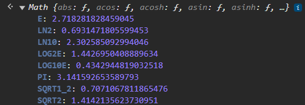

# Math Object in JavaScript

> The `Math` object in JavaScript provides a set of mathematical constants and functions that can be used to perform mathematical operations. It is not a constructor, so all its properties and methods are static.

## 1. Properties of the Math Object

### 1.1 `Math.PI`
The mathematical constant **π (Pi)**, approximately equal to 3.14159.

```js
console.log(Math.PI);  // 3.141592653589793
```

### 1.2 `Math.E`
The base of natural logarithms (Euler's number), approximately equal to 2.718.

```js
console.log(Math.E);  // 2.718281828459045
```

### 1.3 `Math.LN10`
The natural logarithm of 10, approximately equal to 2.302.

```js
console.log(Math.LN10);  // 2.302585092994046
```

### 1.4 `Math.LN2`
The natural logarithm of 2, approximately equal to 0.693.

```js
console.log(Math.LN2);  // 0.6931471805599453
```
<p align="center">
    
</p>

## 2. Methods of the Math Object

### 2.1 `Math.abs()`
The `Math.abs()` method returns the absolute value of a number.

```js
console.log(Math.abs(-7));  // 7
console.log(Math.abs(7));   // 7
```

### 2.2 `Math.round()`
The `Math.round()` method rounds a number to the nearest integer.

```js
console.log(Math.round(4.7));  // 5
console.log(Math.round(4.4));  // 4
```

### 2.3 `Math.ceil()`
The `Math.ceil()` method rounds a number **up** to the nearest integer.

```js
console.log(Math.ceil(4.1));  // 5
console.log(Math.ceil(-4.1)); // -4
```

### 2.4 `Math.floor()`
The `Math.floor()` method rounds a number **down** to the nearest integer.

```js
console.log(Math.floor(4.9));  // 4
console.log(Math.floor(-4.9)); // -5
```

### 2.5 `Math.max()`
The `Math.max()` method returns the largest number from a list of numbers.

```js
console.log(Math.max(1, 5, 3, 9, 2));  // 9
```

### 2.6 `Math.min()`
The `Math.min()` method returns the smallest number from a list of numbers.

```js
console.log(Math.min(1, 5, 3, 9, 2));  // 1
```

### 2.7 `Math.random()`
The `Math.random()` method returns a random floating-point number between 0 (inclusive) and 1 (exclusive).

```js
console.log(Math.random());  // e.g., 0.7352763116533472
```

To generate a random number within a specific range:

```js
function getRandom(min, max) {
    return Math.random() * (max - min) + min;
}
console.log(getRandom(1, 10));  // Random number between 1 and 10
```

### 2.8 `Math.sqrt()`
The `Math.sqrt()` method returns the square root of a number.

```js
console.log(Math.sqrt(25));  // 5
console.log(Math.sqrt(9));   // 3
```

### 2.9 `Math.pow()`
The `Math.pow()` method returns the result of raising a number to a specific power (exponent).

```js
console.log(Math.pow(2, 3));  // 8
console.log(Math.pow(5, 2));  // 25
```

### 2.10 `Math.trunc()`
The `Math.trunc()` method returns the integer part of a number by removing any fractional digits.

```js
console.log(Math.trunc(4.9));  // 4
console.log(Math.trunc(-4.9)); // -4
```

### 2.11 `Math.sign()`
The `Math.sign()` method returns the sign of a number, indicating whether the number is positive, negative, or zero:
- `1` for positive numbers.
- `-1` for negative numbers.
- `0` for zero.

```js
console.log(Math.sign(7));   // 1
console.log(Math.sign(-3));  // -1
console.log(Math.sign(0));   // 0
```

### 2.12 `Math.cbrt()`
The `Math.cbrt()` method returns the cube root of a number.

```js
console.log(Math.cbrt(8));   // 2
console.log(Math.cbrt(27));  // 3
```

## 3. Trigonometric Methods

### 3.1 `Math.sin()`
The `Math.sin()` method returns the sine of an angle (in radians).

```js
console.log(Math.sin(Math.PI / 2));  // 1
```

### 3.2 `Math.cos()`
The `Math.cos()` method returns the cosine of an angle (in radians).

```js
console.log(Math.cos(0));  // 1
```

### 3.3 `Math.tan()`
The `Math.tan()` method returns the tangent of an angle (in radians).

```js
console.log(Math.tan(Math.PI / 4));  // 1
```

## 4. Logarithmic Methods

### 4.1 `Math.log()`
The `Math.log()` method returns the natural logarithm (base **e**) of a number.

```js
console.log(Math.log(1));  // 0
console.log(Math.log(Math.E));  // 1
```

### 4.2 `Math.log10()`
The `Math.log10()` method returns the base-10 logarithm of a number.

```js
console.log(Math.log10(100));  // 2
```

## 5. Exponential Methods

### 5.1 `Math.exp()`
The `Math.exp()` method returns **e** raised to the power of a given number.

```js
console.log(Math.exp(1));  // 2.718281828459045
```

For more information about Math in JavaScript, visit: 
> - [MDN Web Docs](https://developer.mozilla.org/en-US/docs/Web/JavaScript/Reference/Global_Objects/Math)
> - [W3Schools](https://www.w3schools.com/js/js_math.asp)
> - [YouTube (Recommended)](https://www.youtube.com/watch?v=H3-1EQW2evA&list=PLfEr2kn3s-br9ZFmejfLhAgMbGgbpdof8&index=49)