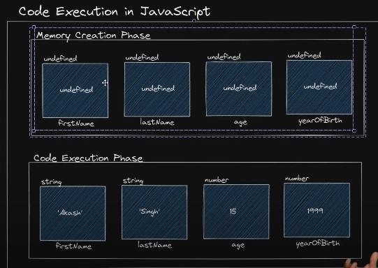
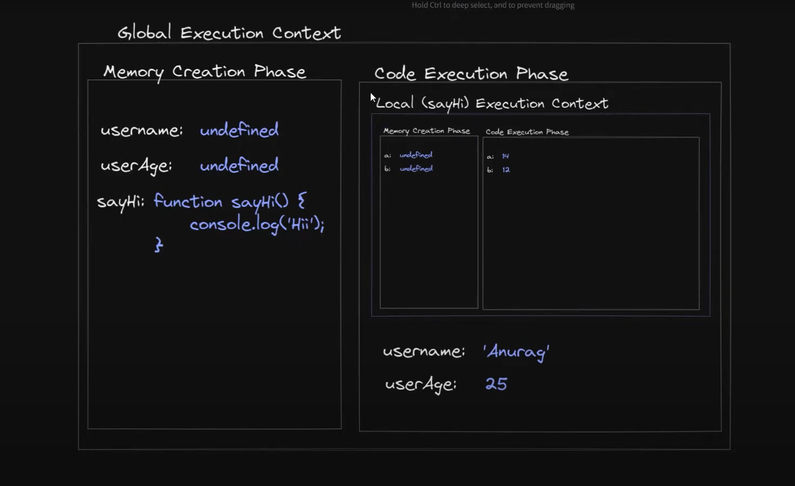

# Memory Creation and Execution Context in JavaScript

JavaScript execution involves two key phases: **Memory Creation Phase** and **Execution Phase**. This happens inside the **Execution Context**. Every time a function is called, a new execution context is created, which contains both the memory and execution phases.

## 1. Execution Context

The **Execution Context** is an environment in which JavaScript code is executed. It consists of:
1. **Memory Component (Variable Environment)**: This is where variables and functions are stored as key-value pairs.
2. **Code Component (Thread of Execution)**: This is where code is executed line by line.

### Global Execution Context (GEC)
When JavaScript code is first run, a **Global Execution Context (GEC)** is created, which manages the global scope.

### Function Execution Context (FEC)
Each time a function is called, a **Function Execution Context (FEC)** is created for that specific function.

## 2. Phases of Execution

### 2.1 Memory Creation Phase (Hoisting)
In this phase, JavaScript allocates memory to variables and functions before executing the code. This is called **hoisting**.

- Variables are initialized with `undefined`.
- Functions are fully hoisted (their entire definition is available).

```js
console.log(x); // undefined (due to hoisting)
var x = 10;

greet();        // "Hello" (function is fully hoisted)
function greet() {
    console.log('Hello');
}
```

### 2.2 Execution Phase
In the execution phase, the code is executed line by line, and variables are assigned values as per the code logic.

```js
var a = 5;  // In memory phase, 'a' is allocated and set to undefined, now updated to 5
function greet() {
    console.log('Hello');
}
```

*memory creation and code execution (inside global execution context) phase image overview*

<p align="center">
    
</p>

## 3. Call Stack

JavaScript has a **call stack** that tracks function calls. The **call stack** is a Last In, First Out (LIFO) structure.

- When a function is invoked, an execution context is created and pushed onto the call stack.
- When the function completes, the context is popped from the stack.

```js
function first() {
    console.log('First');
    second();
}
function second() {
    console.log('Second');
    third();
}
function third() {
    console.log('Third');
}

first();
// Call Stack: 
// third() is called → second() is called → first() is called → global context
```

*memory creation and code execution (inside global execution context) phase for function image overview*

<p align="center">
    
</p>


## 4. Hoisting in Detail

### Variable Hoisting
Variables declared using `var` are hoisted but initialized with `undefined`. Variables declared with `let` and `const` are also hoisted, but they are not initialized and remain in a "temporal dead zone" until they are assigned a value.

```js
console.log(x);  // undefined
var x = 10;

console.log(y);  // ReferenceError: Cannot access 'y' before initialization
let y = 20;
```

### Function Hoisting
Function declarations are hoisted entirely, meaning you can call a function before it is defined in the code.

```js
greet();  // "Hello, World!"

function greet() {
    console.log('Hello, World!');
}
```

## 5. Temporal Dead Zone (TDZ)

Variables declared with `let` and `const` exist in a **temporal dead zone** (TDZ) from the start of their enclosing block until they are initialized.

```js
console.log(x);  // ReferenceError: Cannot access 'x' before initialization
let x = 10;
```

## 6. Global and Local Execution Context

- The **Global Execution Context (GEC)** is created when the code starts running and remains active throughout the execution.
- For each function call, a **Function Execution Context (FEC)** is created and pushed onto the call stack.

### Example of Execution Flow:

```js
function first() {
    console.log('Inside first');
    second();
}

function second() {
    console.log('Inside second');
}

first();
console.log('Global Context');
```

Execution steps:
1. **Global Execution Context** is created and `first()` is called.
2. A new **Function Execution Context** is created for `first()`.
3. Inside `first()`, `second()` is called, creating another **Function Execution Context**.
4. Once `second()` finishes, the context is removed, and control returns to `first()`.
5. After `first()` finishes, its context is removed, and the global context resumes execution.

## 7. JavaScript Engine

JavaScript is executed in a **JavaScript Engine** (such as V8 in Chrome). The engine contains:
1. **Memory Heap**: Where memory allocation happens.
2. **Call Stack**: Where execution contexts are managed.

For more information about Code execution in JavaScript, visit: 
> - [GeeksForGeek](https://www.geeksforgeeks.org/javascript-code-execution/)
> - [FreeCodeCamp](https://www.freecodecamp.org/news/how-javascript-works-behind-the-scene-javascript-execution-context/)
> - [YouTube (Recommended)](https://www.youtube.com/watch?v=FMhPjmO0ziE&list=PLfEr2kn3s-br9ZFmejfLhAgMbGgbpdof8&index=46&pp=iAQB)
> - [YouTube (Function)](https://www.youtube.com/watch?v=JfW1fBRCeLU&list=PLfEr2kn3s-br9ZFmejfLhAgMbGgbpdof8&index=71)
> - [YouTube (Call Stack)](https://www.youtube.com/watch?v=kfxITcxEsG0&list=PLfEr2kn3s-br9ZFmejfLhAgMbGgbpdof8&index=72)


